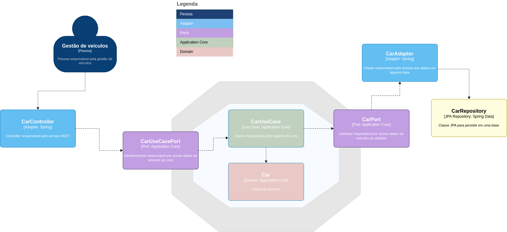

# Vehicle Manager API

RESTful API para o gerenciamento de veículos.

## Tecnologias utilizadas

  - [Java 11](https://www.oracle.com/java/)

  - [Spring Boot](https://spring.io/projects/spring-boot)

  - [Spring Data](https://spring.io/projects/spring-data)

  - [Maven](http://maven.apache.org/)

  - [Lombok](https://projectlombok.org)
  
  - [MapStruct](https://mapstruct.org/)
  
  - [OpenAPI](https://swagger.io/specification/)  

  - [JUnit 5](https://junit.org/junit5/)

  - [Mockito](https://site.mockito.org/)
  
  - [Hamcrest](https://hamcrest.org/JavaHamcrest/)

## Setup
    
  - Instalar Docker e Docker Compose
   
  - Executar o comando
  
```bash
$ docker-compose up --build -d 
```

## Executar os testes
    
```bash    
$ mvn test
```
    
## Acessar a aplicação

  - Após subir a aplicação, acessar os endpoints em [http://localhost:8080/](http://localhost:8080/)
  
  - O Swagger pode ser acessado em [http://localhost:8080/swagger-ui.html](http://localhost:8080/swagger-ui.html)
   
## Banco de dados

  - Os dados estão armazenados em memória no banco de dados H2
  
  - Para visualizar os dados, acessar [http://localhost:8080/h2](http://localhost:8080/h2)
  
    - Os dados de configuração (url, username e password) estão no arquivo application.yml no módulo adapters

## Arquitetura 

  - A aplicação foi desenvolvida baseada na arquitetura hexagonal. 



